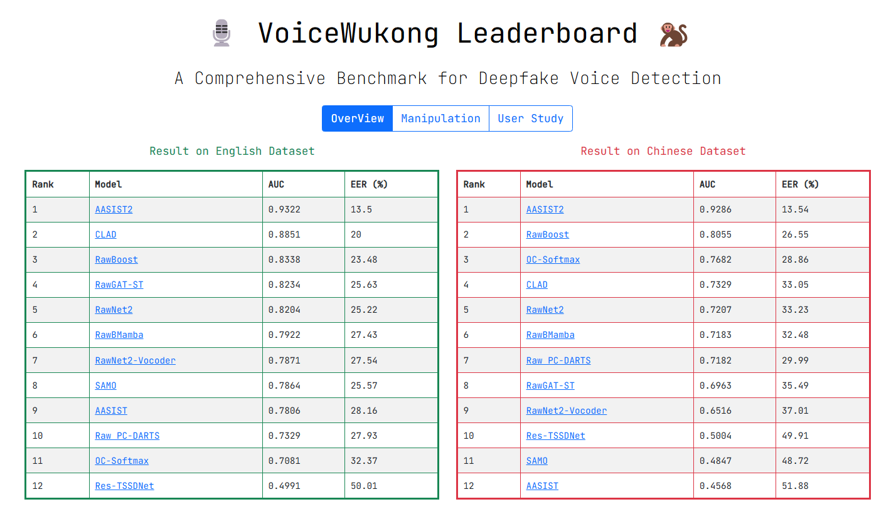
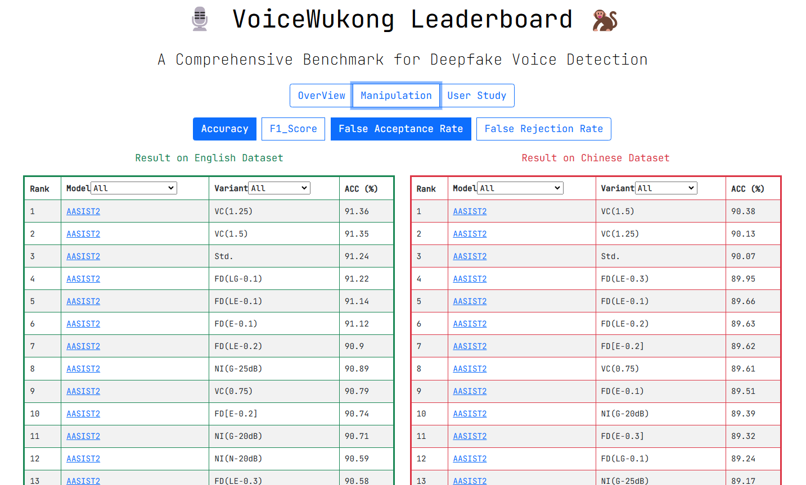
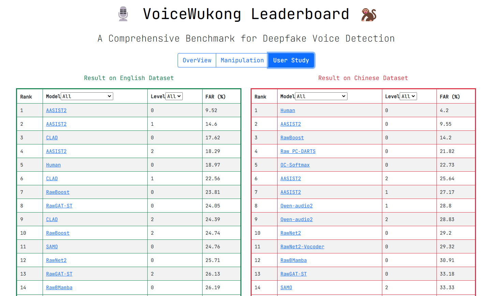

# VoiceWukong
VoiceWukong is a comprehensive benchmark for deepfake voice detection, designed to evaluate the performance of various detectors in real-world application scenarios.

**Dataset Features**
- Large Scale: Contains 265,200 English and 148,200 Chinese deepfake voice samples
- Diverse Sources: Covers voice samples generated by 19 commercial tools and 15 open-source tools
- Real-world Scenarios: Constructed 38 data variants covering 6 types of audio manipulations common in practical applications
- Bilingual Support: Supports evaluation in both Chinese and English languages

**Evaluation Results**
- Conducted comprehensive evaluations on 12 state-of-the-art deepfake voice detectors
- [AASIST2](https://github.com/TakHemlata/SSL_Anti-spoofing) achieved the best performance with an Equal Error Rate (EER) of 13.50%
- Other detectors showed EERs exceeding 20%
- Results indicate significant challenges for current detectors in practical applications

**Human-Machine Comparison Study**

- Conducted user studies with over 300 participants
- Comparative analysis of detection capabilities among humans, detectors, and multimodal large language models ([Qwen2-Audio](https://github.com/QwenLM/Qwen2-Audio))
- Different detectors and humans showed varying identification capabilities for deepfake voices at different deception levels
- Multimodal large language models demonstrated no effective detection ability

## Dataset
- Our dataset is open-source and can be obtained through an application [here](https://zenodo.org/records/13731918).

## Leaderboard
Our leaderboard presents comprehensive evaluation results in three main sections:

1. **Overall Performance** - General evaluation metrics for each detector across the entire dataset, providing a broad view of detection capabilities.

2. **Manipulation-specific Performance** - Detailed results showing how each detector performs under different types of audio manipulations, offering insights into specific strengths and weaknesses.

3. **User Study-based Evaluation** - Performance analysis of detectors on deepfake voices categorized by difficulty levels based on our user study results, demonstrating detector effectiveness across varying deception capabilities.

Visit our [leaderboard](https://voicewukong.github.io/) for detailed performance metrics and rankings.

## Evaluated Detectors' Weighted Models
- All evaluated detectors’ weighted models can be obtained from [here](https://huggingface.co/VoiceWukong/VoiceWukong/).

## User Study Results & Original Outputs
- This code repository stores our [user study results](https://github.com/VoiceWukong/VoiceWukong/tree/main/Userstudy/result) and the [original outputs](https://github.com/VoiceWukong/VoiceWukong/tree/main/OutputScore) of the evaluation detectors.

## Usage License

 Our dataset is currently available exclusively to the academic research community through an application and approval process. To prevent misuse of the dataset or any potentially illegal activities, applicants must strictly comply with the following conditions before accessing our dataset:
>1.  Eligibility: Access to the dataset is limited to academic researchers for the purpose of evaluating detectors.
>2. Redistribution Prohibition: Recipients are not permitted to redistribute the dataset without explicit permission.
>3. Commercial Use Restrictions: The dataset may not be used for any commercial purposes, including but not limited to:
>>- Product testing
>>- Development activities
>>- Commercial deployment 
>>- Model fine-tuning
>>- Training commercial systems
>>- Other profit-oriented uses
>4. Legal Compliance: The use of the dataset for any activities prohibited by law is strictly forbidden.

<!--
**VoiceWukong/VoiceWukong** is a ✨ _special_ ✨ repository because its `README.md` (this file) appears on your GitHub profile.

Here are some ideas to get you started:

- 🔭 I’m currently working on ...
- 🌱 I’m currently learning ...
- 👯 I’m looking to collaborate on ...
- 🤔 I’m looking for help with ...
- 💬 Ask me about ...
- 📫 How to reach me: ...
- 😄 Pronouns: ...
- ⚡ Fun fact: ...
-->
